# **Table of Contents**

* [**Purpose**](#purpose)
* [**User Experience Design (UX)**](#user-experience-design)
  * [**User stories**](#user-stories)
  * [**Structure**](#structure)
  * [**Design**](#Design)
    * [**Colour Scheme**](#colour-scheme)
    * [**Typography**](#typography)
    * [**Frameworks**](#frameworks)
    * [**API**](#api)
     * [**Icons**](#icons)
    * [**Wireframes**](#Wireframes)
- [**Features**](#features)
    * [**Existing Features**](#existing-features)
    * [**Features on every page**](#features-on-every-page)
    * [**Home page**](#home-page)
    * [**Future Features**](#future-features)
- [**Technologies Used**](#technologies-used)
    * [**Front End Technologies**](#front-end-technologies)
    * [**Other Technologies**](#other-technologies)
* [**Testing**](#testing)
    * [**Code Testing**](#code-testing)
      * [**Validator Testing**](#validator-testing)
    * [**User Story Testing**](#User-Story-Testing)
    * [**Manual Testing**](#manual-testing)
      * [**Lighthouse**](#lighthouse)
      * [**Responsive Testing**](#responsive-testing)
    * [**Bug Report**](#bug-report)
* [**Deployment**](#deployment)
    * [**GitHub Pages**](#using-github-pages)
    * [**Locally**](run-locally)
* [**Credits**](#credits)
     * [**Code**](#code)
  * [**Acknowledgements**](#acknowledgements)

# **Word-Connect**
## **Purpose**

I created this website to be able to play a game similar gameshow called only connect hosted by the bbc. This Website focuses on the final round of the game show only connect where a 4x4 grid of jumbled words appear and the players have to find out which four words are linked together and what links them together.

**Word-Connect** offers a experience similar to only connects final round so users can play the game without going onto the show themselves. Users get a final score to at the end of the game and also have the ability to add games to the website through the sumbission form page. 

# **User Experience Design**

## **User Stories**
- As a user, I want to be able learn how to play this game through a set of instructions so I can understand how to play.
- As a user, I want to be able to see what rules the game has so I know what rules I have to follow  . 
- As a user, I want to be able to see all social media involed with this website so I can follow them on social media. 
- As a user, I want to be able view the website on all devices so I can show others the website on my mobile phone or laptop. 
- As a user, I want to be able to navigate through the website easily.
- As a user, I want to be able know my final score when the game is over so I can check if my scores are getting better. 
- As a user, I want to be able start a new game after my game has finished without having to refresh the page. 
- As a user, I want to be able to see a timer and lives counter so I can keep track of my time and lives remaining. 
- As a user, I want to be able to add games so I can see if my words and links will make it onto the website. 
- As a user, I want a well designed UX so it is easy for me to play the game and navigate the website.

## **Structure**
Every page contains a Navigation bar at the top of the webpage that will dissapear when you scroll down and reappear when you scroll up. it will direct them to new pages making it easy to navigate the website 
<br>This fufils the user story:
> As a user, I want to be able to navigate through the website easily.

All pages  contain a Footer Element with links to the **Word-Connect** social media and a copyright disclaimer
<br>This fufils the user story:
>As a user, I want to be able to see all social media involed with this website so I can follow them on social media.

All pages are fully responsive and the layouts will change dependant on screen size. To ensure that content is displayed properly and is readable on every device
<br>This fufils the user stories:

> As a user, I want to be able view the website on all devices so I can show others the website on my mobile phone or laptop. 
> As a user, I want a well designed UX so it is easy for me to play the game and navigate the website.

The home page contains 3 sections, each of these sections give the relavant information on how to play **Word-Connect**, the rules of **Word-Connect** and the Acknowledgements 
<br>
This fufils the user stories:

> As a user, I want to be able learn how to play this game through a set of instructions so I can understand how to play.
> As a user, I want to be able to see what rules the game has so I know what rules I have to follow. 

The Play game page is the page that allows you to start the game it shows you your score,lives and time remaining, once the game ends your score will appear and you will be able to press a button to restart the game.
<br>
This fufils the user stories:

>As a user, I want to be able know my final score when the game is over so I can check if my scores are getting better. 
>As a user, I want to be able start a new game after my game has finished without having to refresh the page.
>As a user, I want to be able to see a timer and lives counter so I can keep track of my time and lives remaining

The Add Game page has a form that you can fill out to create your own game this data will be posted to a google sheet through the fetch api which will then be reviewed to see if its appropriate to add to the game 
<br>
This fufils the user story:
>As a user, I want to be able to add games so I can see if my words and links will make it onto the website. 


## **Design**
---

### **Colour Scheme**

<h2 align=center id="top">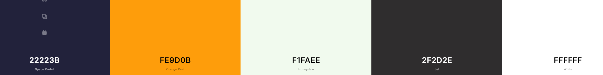</h2>


### **Typography**

- [**Press Start 2P**](https://fonts.google.com/specimen/Press+Start+2P?query=pres)
    - The primary font across the website.
    - Press Start 2P was used for the main heading tags and the end game screen. 
    - Press Start 2P was chosen due its distinct style.

- [**Roboto**](https://fonts.google.com/specimen/Roboto?query=rob)
    - The secondary font across the website.
    - Roboto was used for the Navigation bar Links and paragraphs and some headings in fonts weights of 500 and 700.
    - Roboto was chosen for its readablity.

### **Frameworks**
- [MDBoostrap](https://mdbootstrap.com/)
    - Taking the responsiveness of Bootstrap and the front-end UI of Materialize, MDBoostrap makes use of both of these. So all aspects of the site were clean and accessible for all users. 

- [JQuery](https://code.jquery.com/jquery/)
    - In order to minimalize the amount of Javascript used across the application, I chose to implement a lot of the JS functionality with JQuery.

### **API**
- [**Fetch API**](https://developer.mozilla.org/en-US/docs/Web/API/Fetch_API)
    - This was used along side the google script editor to post data from a form to a google spread sheet.
    - You can view this by logging into the gmail wordconnectms2@gmail.com Passoword: Word-Connect. You can access the shee the data is posted to and also the script code.


### **Icons**
- [Font Awesome Icons](https://fontawesome.com/)
    - All the icons used across this website were taken from Font Awesome and styled to match the colour scheme.

### **Wireframes**

#### **Home**
<h2 align=center id="top"></h2>

#### **Game**
<h2 align=center id="top">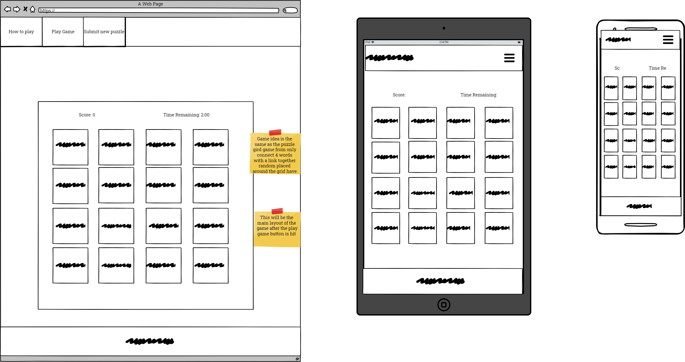</h2>


#### **form**
<h2 align=center id="top">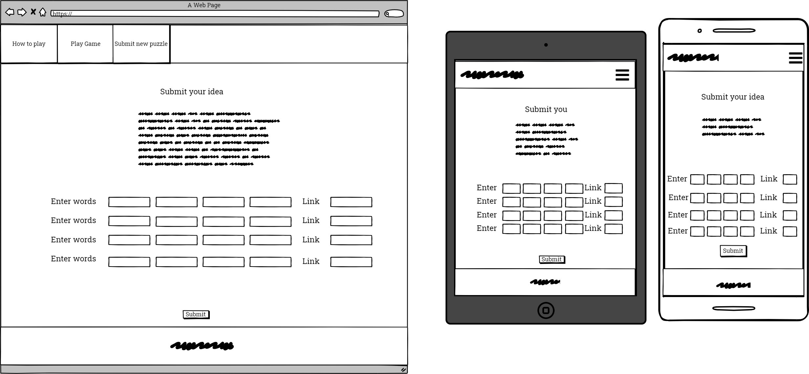</h2>

## **Features**
---
### **Existing Features**
###  **Features on every page**
- Navigation bar on Desktop
<h2 align=left id="top">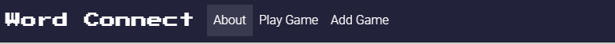</h2>

- Navigation bar on Tablet/Mobile
<h2 align=center id="top">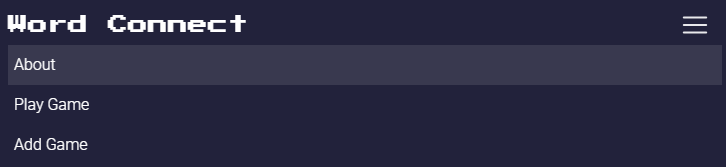</h2>

- Footer on Desktop/Tablet/Mobile
<h2 align=center id="top"></h2>


### **Home page**
The Home page has 3 headings which explains everything that you need to know about the game 
- A How To Play section that gives a brief explaination of how to play.
- A Rules section that contains the list of rules for this game.
- An Acknowledgement heading that shows the user where this idea came from.

### **Game page**
The Game page has a single container with a play button in the middle and a timer,score and lives section on top. 
Once you press play 16 tiles will appear that you can click on. Once you click on 4 tiles the game will compare your answer to the correct answer, If the answer is correct the 4 highlighted tiles will dissappear and reappear and the top of the container and there colour will be green to show that the answer is correct. If the answer is incorrect the tiles will revert to he normal colour.
Once the game has ended by running out of time,lives or by getting all the answers correct four of the tiles will apear with an input box and a button. You must guess the connection between these four words and check your answer by clicking the button this will repear another 3 times. 
At the end of this a game over heading will appear along with your score and a button to play again.

### **Form page**
This page is a form that allows a user to input 16 words and 4 links 4 words perlink, Once they have submitted the form it will post that data to a google sheet through the fetch api allowing me to review the form input to see if its appropriate to add to the game 

### **Future Features**

- Unique Games
    - I would like to be able for a user to create there own of word-connect by adding these games to a data base. So you could be able to create your own unique game and not have random words mixed in with them.
- Share Games
    - I would like to be able to impliement the ability for users to share games that they have created or games that they have gotten stuck on to see if other can beat it. 


## **Technologies Used** 
---
- ### **Front End Technologies**
    - HTML
    - CSS
    - Javascript
    - [**JQuery**](https://jquery.com/) to simplify DOM manipulation.
    - [**MDBoostrap**](https://mdbootstrap.com/) a front end framework used to create responsive aspects across the site. 
    - [**Font Awesome**](https://fontawesome.com/) Font awesome Icons are used for the Social media links contained in the Footer section of the website.
    - [**Google Fonts**](https://fonts.google.com/) Google fonts are used throughout the project.


- ### **Other Technologies** 
    - [**Gitpod**](http://gitpod.io/) the cloud based IDE used for development 
    - [**Github**](https://github.com/) to store and share all project code remotely.
    - [**Balsamiq**](https://balsamiq.com/?gclid=Cj0KCQjwo6D4BRDgARIsAA6uN1-NxDOthq9pGqYzB_1iRxlBvHVwi_4_LaZuGqQT46csctF0xCiTXUMaAqmuEALw_wcB) used to create wireframes.
     - [**Fetch api**](https://developer.mozilla.org/en-US/docs/Web/API/Fetch_API) used post data to a google sheet.
## **Testing** 
---

### **Code Testing**
#### **validator testing**
[W3C Markup Validation](https://validator.w3.org/)

W3C Markup Validation was used to validate both the HTMl and CSS for this application.
- No errors were noted in the CSS 
- No errors were noted in the HTML

**Home**
<h2 align=center id="top">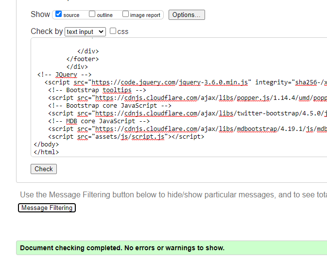</h2>

**Game**
<h2 align=center id="top"></h2>

**Form**
<h2 align=center id="top"></h2>

**CSS**
**Game**
<h2 align=center id="top">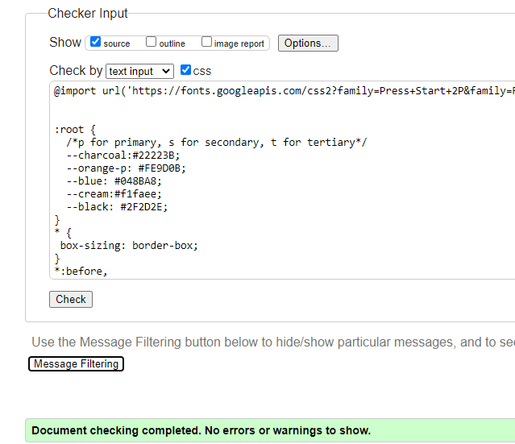</h2>

[JSHint](https://jshint.com/)
 
 **Metrics**

- There are 31 functions in this file.

- Function with the largest signature take 2 arguments, while the median is 0.

- Largest function has 25 statements in it, while the median is 5.

- The most complex function has a cyclomatic complexity value of 14 while the median is 2.

- Eight undefined variables. (These are my window variables)

<h2 align=center id="top">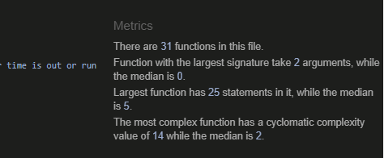</h2>

### **User Story Testing**
1. As a user, I want to be able learn how to play this game through a set of instructions so I can understand how to play.
    - The Home page has a how to play sections witch goes through how the game is played and how to answer the questions.
2. As a user, I want to be able to see what rules the game has so I know what rules I have to follow .
    - The Home Page contains a rules section that has a list of all the rules in it.
3. As a user, I want to be able to see all social media involed with this website so I can follow them on social media. 
    - Every page has a footer element with links to all of **Word-Connects's**  social media.

4. As a user, I want to be able view the website on all devices so I can show others the website on my mobile phone or laptop
    - The **Word-Connect** Website is fully responsive, You can view it on all devices.
5. As a user, I want to be able to navigate through the website easily.
    - Every page has a navigation bar at the top of it with links to all pages.
6. As a user, I want to be able know my final score when the game is over so I can check if my scores are getting better. 
    - When the game ends there will and end game screen with your final score.
7. As a user, I want to be able start a new game after my game has finished without having to refresh the page
     - The end game screen has a play again button on it which will reset the game.
8. As a user, I want to be able to see a timer and lives counter so I can keep track of my time and lives remaining. 
     - The game has a timer and lives counter at the top.

9. As a user, I want to be able to add games so I can see if my words and links will make it onto the website. 
    - The **Word-Connect** website has a form where everyone can submit their games.
10. As a user, I want a well designed UX so it is easy for me to play the game and navigate the website.
    - The **Word-Connect** Website is fully responsive containing header and footer elements making it easy to navigate through the website.
 

### **Manual Testing**

manual testing was completed to make sure each page was fully responsive and the game had no issues while being played


#### **Lighthouse**

A desktop Lighthouse report was completed on Word-Connect's website
The results were as follows:
<h2 align=center id="top">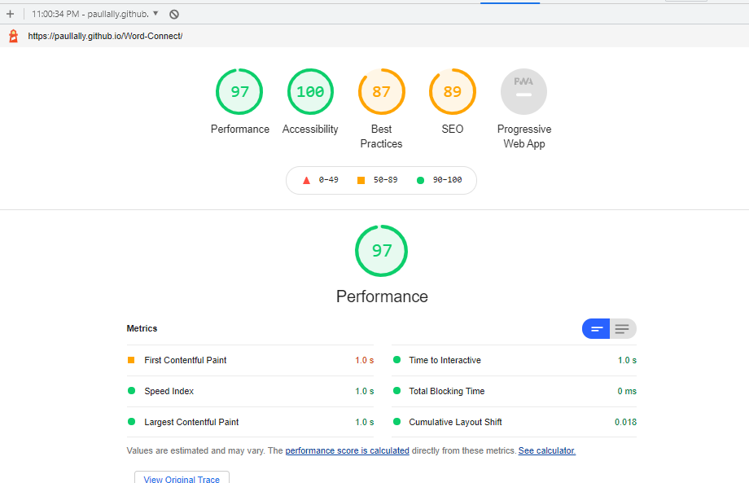</h2>

A mobile Lighthouse report was completed on Word-Connect's website
The results were as follows:
<h2 align=center id="top">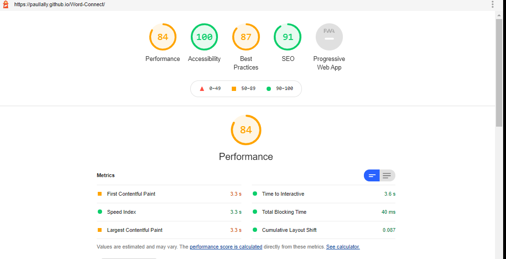</h2>

### **Responsive Testing**
<h2 align=center id="top">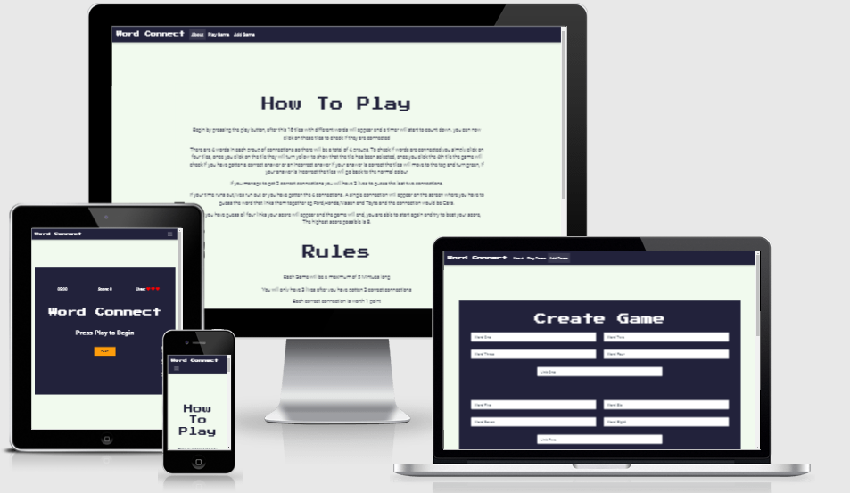</h2>


### **Desktop Testing**
-
    | Page | Responsive| Notes| 
    --- | --- | ---
    Home | Y | Fully Responsive.
    Game | Y | Fully Responsive.  
    Form | Y | Fully Responsive.


### **Laptop Testing**
-
    | Page | Responsive| Notes| 
    --- | --- | ---
    Home | Y | Fully Responsive.
    Game | Y | Fully Responsive.  
    Form | Y | Fully Responsive.


    
### **Tablet Testing**
-
    | Page | Responsive| Notes| 
    --- | --- | ---
    Home | Y | Navigation bar Turns to hamburger menu
    Game | Y | Navigation bar Turns to hamburger menu 
    Form | Y | Navigation bar Turns to hamburger menu

### **Mobile Testing**
-
    | Page | Responsive| Notes| 
    --- | --- | ---
    Home | Y | Fully Responsive.
    Game | Y | Game cards appear in 1's instead of 4's
    Form | Y | Form turns into rows of one.


# **Deployment**

### **Using Github Pages**

This project was developed using the Gitpod IDE, committed to git and pushed to GitHub using the built in function within Gitpod.

To deploy this page to GitHub Pages from its GitHub repository, the following steps were taken:

1. Log into GitHub.
2. From the list of repositories on the screen, select paullally/Word-Connect
3. From the menu items near the top of the page, select Settings.
4. Scroll down to the GitHub Pages section.
5. Under Source click the drop-down menu labelled None and select Master Branch
6. On selecting Master Branch the page is automatically refreshed, the website is now deployed.
7. Scroll back down to the GitHub Pages section to retrieve the link to the deployed website.

### **Run Locally**
To clone this project into Gitpod you will need:
1. A Github account. [Create a Github account here](https://github.com/)
2. Use the Chrome browser 

Then follow these steps:
1. Install the [Gitpod Browser Extentions for Chrome](https://www.gitpod.io/docs/browser-extension/)
2. After installation, restart the browser
3. Log into [Gitpod](https://gitpod.com) with your gitpod account.
4. Navigate to the [Project GitHub repository](https://github.com/paullally/Word-Connect)
5. Click the green "Gitpod" button in the top right corner of the respository
6. This will trigger a new gitpod workspace to be created from the code in github where you can work locally.

To work on the project code within a local IDE such as VSCode:
1. Follow this link to the [Project GitHub repository](https://github.com/paullally/Word-Connect).
2. Under the repository name, click "Clone or download".
3. In the Clone with HTTPs section, copy the clone URL for the repository. 
4. In your local IDE open the terminal.
5. Change the current working directory to the location where you want the cloned directory to be made.
6. Type ```git clone```, and then paste the URL you copied in Step 3.
7. Press Enter. Your local clone will be created.

# **Credits**

## **Code**

[Geeksforgeeks](https://www.geeksforgeeks.org/how-to-fetch-data-from-json-file-and-display-in-html-table-using-jquery/) was used to help with getting the json data from a file and adding it to the html.

[Github](https://github.com/jamiewilson/form-to-google-sheets/blob/master/README.md) was used to help post the form data to a google sheet using the script editor.

Help with the footer was gotten from [ Keep that damn footer at the bottom. ](https://medium.com/@zerox/keep-that-damn-footer-at-the-bottom-c7a921cb9551).

[animista](https://animista.net/) was used to help with the css for animations in the game.
 ## **Acknowledgements**

**Word-Connect** was inspired by the bbc gameshow [only connect](https://www.bbc.co.uk/programmes/b00lskhg).

Thanks to my Mentor [Chris Quinn](https://github.com/10xOXR). for all the input and support during this project.